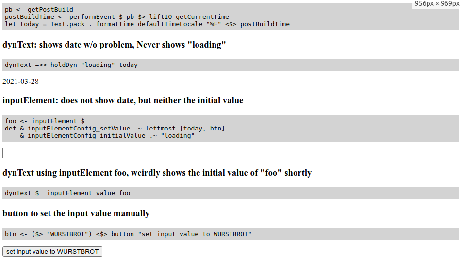

## Result

## How to run

- install [Obelisk](https://github.com/obsidiansystems/obelisk)
- checkout this repo

    $> g clone git@github.com:rubenmoor/reflex-bug-pbtime.git
    $> cd reflex-bug-pbtime

- run

    $> ob run

- visit http://localhost:8000
