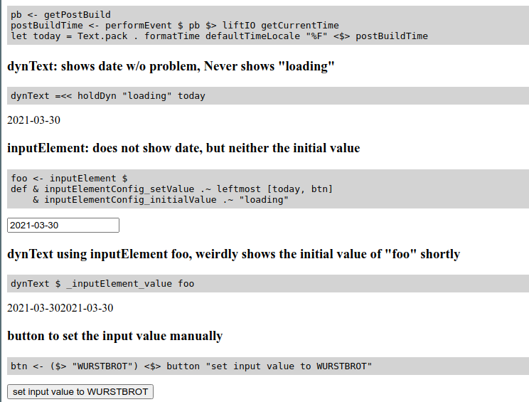

## Result

Original bug on branch `main`.


Fix with other issues on branch `development`.



## How to run

- install [Obelisk](https://github.com/obsidiansystems/obelisk)
- checkout this repo

``` shell
    $> g clone git@github.com:rubenmoor/reflex-bug-pbtime.git
    $> cd reflex-bug-pbtime
```

- run

``` shell
    $> ob run
```

- visit http://localhost:8000
